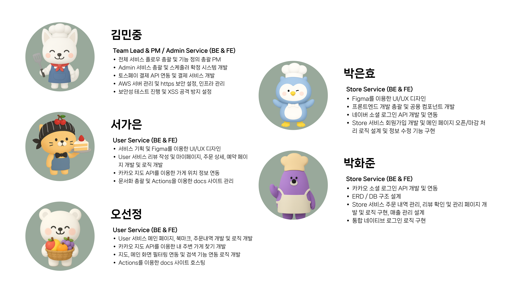

# 🥖 **OhGoodFood - 마감 식품 특가 플랫폼**
<br>
<a href="https://ohgoodfood.com">
    
</a>

<p style="text-align: center;">이미지를 클릭하면 OhGoodFood 플랫폼으로 이동합니다.</p>

## 🔗 목차

1. [프로젝트 소개](#프로젝트-소개)
2. [주요 기능](#주요-기능)
3. [팀 소개](#팀-소개)
4. [기술 스택](#기술-스택)
5. [파일 구조](#파일-구조)
6. [시스템 구조](#시스템-구조)
7. [보안](#보안)
8. [빌드 방법](#빌드-방법)
9. [협업 규칙](#협업-규칙)

----------------------------

<h2 id="프로젝트-소개">🖐🏻 프로젝트 소개</h2>
<br>


한 해 전 세계에서 버려지는 음식물 **10억 5,000만 톤**
이는 전체 온실가스 배출량의 **10%**를 차지하는 큰 문제입니다.

만약 **마감 임박 식품을 저렴하게 구매**할 수 있다면,
소비자는 합리적이고 가치 있는 소비를,  
판매자는 재고 처리 비용을 줄일 수 있습니다.  
불필요한 폐기는 줄이고, 환경 오염과 비용 낭비를 막을 수 있습니다.

새로운 소비 패러다임 **OhGoodFood**와 함께 모두에게 더 나은 가치를 선사하세요!

----------------------------

<h2 id="주요-기능">🎯 주요 기능</h2>

### 👤 사용자
- 예약 가능한 상품 조회 및 오늘 픽업 & 내일 픽업 제품 선택 가능
- 필터링 기능을 통해 주문 상태 필터링 조회 가능
- 리뷰 작성 및 내가 작성한 리뷰, 전체 리뷰 조회 가능
- 북마크를 통한 관심 가게 등록 가능

### 🏪 가게(사장님)
- 오굿백 상품 등록 및 마감 가능
- 예약 목록 확인 및 픽업 처리, 취소 처리 가능
- 내 가게 리뷰 확인 및 월별 매출 확인 가능

### 👀 관리자
- 가게 등록 요청 승인 및 거절을 통한 사용자 관리 가능
- 전체 회원 조회 및 상품 목록 조회 가능
- 예약, 픽업 상태 확인 및 관리 가능
- 사용자, 사장님에게 알림 전송 가능
- 전체 어플 매출 관리 및 통계 기능 제공

----------------------------

<h2 id="팀-소개">👥 팀 소개</h2>



----------------------------

<h2 id="기술-스택">🔧 기술 스택</h2>

| 구분             | 기술 스택                                                                                                                                                                                                                                                                                                                            |
| ---------------- | ------------------------------------------------------------------------------------------------------------------------------------------------------------------------------------------------------------------------------------------------------------------------------------------------------------------------------------- |
| Frontend         |      |
| Backend          |     |
| Database         |                                                                                                                                                                                                                                 |
| Server Build          |    |
| Cloud            |                                                                                                                   |
| 외부 API 및 연동 |     |


----------------------------

<h2 id="파일-구조">📂 파일 구조</h2>

```markdown
├─java
│  └─kr
│      └─co
│          └─ohgoodfood
│              ├─config              # ✅ Spring 설정 클래스 (MvcConfig, 파일 업로드 설정)
│              ├─controller          # ✅ 클라이언트 요청 처리 컨트롤러 계층
│              │  ├─admin            # └─ 관리자용 컨트롤러 (가게 승인, 통계 조회 등)
│              │  ├─common           # └─ 공통 기능 컨트롤러 (로그인, 알림 등)
│              │  ├─store            # └─ 사장님용 컨트롤러 (상품 관리, 리뷰 확인 등)
│              │  └─users            # └─ 일반 사용자 컨트롤러 (메인화면, 주문, 마이페이지 등)
│              ├─dao                 # ✅ MyBatis Mapper 인터페이스 (DB 접근)
│              ├─dto                 # ✅ DTO/VO 클래스
│              ├─service             # ✅ 비즈니스 로직 처리 계층
│              │  ├─admin            # └─ 관리자 서비스 구현
│              │  ├─common           # └─ 공통 서비스 (알림, 인증 등)
│              │  ├─store            # └─ 사장님 서비스 구현
│              │  └─users            # └─ 사용자 서비스 구현
│              └─util                # ✅ 공통 유틸 클래스 (인터셉터 등)
├─resources
│  └─kr
│      └─co
│          └─ohgoodfood
│              └─dao                # ✅ MyBatis 매퍼 XML 파일 위치 (SQL 정의)
└─webapp
    ├─css
    │  └─font                       # ✅ 웹폰트 파일 저장
    ├─img                           # ✅ 정적 이미지 파일 저장
    ├─popup                         # ✅ 팝업 전용 JSP (모달 등)
    ├─resources
    └─WEB-INF
        ├─spring
        │  └─appServlet             # ✅ Spring DispatcherServlet 설정 XML 위치
        └─views
            ├─admin                 # ✅ 관리자 전용 JSP 뷰
            ├─common                # ✅ 공통 JSP 뷰 
            ├─store                 # ✅ 사장님 전용 JSP 뷰
            └─users                 # ✅ 사용자 전용 JSP 뷰
```

----------------------------

<h2 id="시스템-구조">🧱 시스템 구조</h2>


----------------------------

<h2 id="보안">🕶️ 보안</h2>

> 사장님과 일반 사용자가 함께 이용하는 애플리케이션인 만큼, 보안 취약점에 대한 철저한 대비가 필요했습니다.
> 최근 잇따른 보안 사고를 고려하여, 자주 발생할 수 있는 주요 보안 이슈들에 대한 대책을 수립하고 모두 적용하였습니다.

### 1️⃣ SQL Injection

**개념**

- **SQL Injection** 은 공격자가 입력값에 악의적인 SQL 코드를 삽입해 데이터베이스를 조작하는 기법입니다.
- 예를 들어, 로그인 폼에 `’ OR ’1’=’1` 과 같은 문자열을 넣으면 비밀번호 검사 로직을 우회하여 사이트에 접속이 가능합니다.

**대응 방법: MyBatis `#{}` 바인딩**

- `#{}` 로 전달된 값은 **JDBC `PreparedStatement`** 의 파라미터로 처리됩니다.
- 모든 mapper에 `#{}` 바인딩을 적용하여  SQL Injection을 방지하였습니다.
- SQL 문과 데이터가 분리되므로, 입력값은 자동으로 이스케이프되어 쿼리 구조 변경이 불가능합니다.

### 2️⃣ XSS 방지

**개념**

- XSS는 `<script>` 삽입을 통해 악성 스크립트를 실행해 정보를 탈취하거나 조작하는 공격입니다.

**대응 방법 : 요청 파라미터를 HTML 이스케이프 처리**

- `XSSFilter` + `XSSRequestWrapper` 로 모든 요청 파라미터를 HTML 이스케이프 처리하고, Spring 전역 `StringEscapeEditor` 를 통해 `@RequestParam`/`@ModelAttribute` 로 바인딩되는 문자열까지 필터링해 방어합니다.
- [관련 깃 이슈](https://github.com/OhGoodTeam/OhGoodFood/issues/139)

### 3️⃣ 파일 업로드 검증 (비인가 파일 업로드 차단)

**개념**

- CSRF는 사용자의 인증된 세션을 악용해 원치 않는 요청을 실행하는 공격입니다.

**대응 방법 : 이미지 확장자에 해당하는 파일들만 허용**

- S3 업로드 시 **.jpg, .jpeg, .png** 확장자만 허용하도록 필터링해 비인가 파일 삽입을 차단합니다.

----------------------------

<h2 id="빌드-방법">🚀 빌드 방법</h2>

### 1️⃣ Prerequisites (필요 환경)

> Java 11  
> Maven 4.0.0  
> STS(Spring Tool Suite) 또는 IntelliJ IDEA  

### 2️⃣ 우리 프로젝트 git clone

```java
git clone https://github.com/OhGoodTeam/OhGoodFood.git
cd repo;
```

- clone 해서 repo로 이동
- main repo를 기준으로 합니다.

### 3️⃣ Maven 실행하기

3.1. STS

- 프로젝트 우클릭 → run as → maven clean → build sucess 

3.2. IntelliJ

- File → Open → `pom.xml` 선택
- 오른쪽 Maven 창에서 Sync/Reload All Maven Projects

### 4️⃣ Maven Export

4.1. STS

- 프로젝트 우클릭 → Run As → Maven clean → Maven Install
- 루트디렉토리/target 에 war파일 생성 → Tomcat 배포시 ROOT.war로 이름 변경 후 배포

4.2. IntelliJ IDEA

- File → Project Structure → Artifacts
- Name : `ohgoodfood:war`, Type `Web Application Archive` → OK
- target 폴더에 `ohgoodfood.war` 파일 생성 완료

----------------------------

<h2 id="협업-규칙">🤝 협업 규칙</h2>

### 🥖 Branch 규칙
- 메인 브랜치와 개인 이름별 브랜치를 구분하여 사용한다.
  - main : 배포 가능한 상태의 코드만을 관리하는 브랜치
  - dev  : main 배포 전 전체 기능 통합 test 브랜치

### 🥖 Commit 규칙
- 커밋 메세지는 다음과 같은 형식으로 작성한다.

```java
[이름] 명령:구현설명 ex) [gildong] feat:로그인서비스구현
```

- **깃 컨벤션**
    - feat : 로직 구현
    - docs : 정적 파일 추가
    - fix : 버그 수정

### 🥖 PR 규칙
- 공용 템플릿을 사용하여 PR을 작성 : [PR 템플릿 바로가기](https://github.com/OhGoodTeam/OhGoodFood/blob/main/.github/PULL_REQUEST_TEMPLATE.md)

### 🥖 Issue 규칙
- 공용 템플릿을 사용하여 issue 작성 : [issue 템플릿 바로가기](https://github.com/OhGoodTeam/OhGoodFood/tree/main/.github/ISSUE_TEMPLATE)


